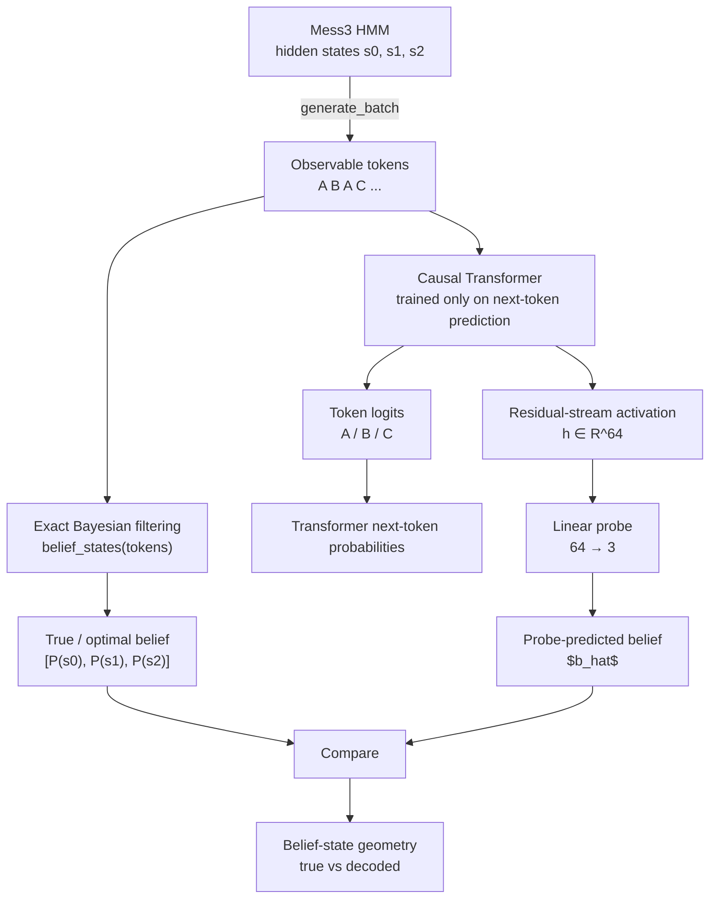

This repository is a ground-up implementation and study of [*Transformers Represent Belief State Geometry in Their Residual Stream*](https://arxiv.org/abs/2405.15943) by Adam S. Shai et al.

The reference and more 'terminal ready' implementation is by [danibalcells'  `belief-state-transformers`  repository](https://github.com/danibalcells/belief-state-transformers).

My goal is to reproduce the core belief-state geometry experiment from the ground up, understand each component in detail, and later extend the setup by modifying the HMM observation dynamics while controlling the underlying latent transition process.


# Belief-State Geometry in Transformers -> Mess3 Replication/

This repository is my ground-up replication and study of the **Mess3 belief-state transformer experiment** , inspired by the work on belief-state geometry in next-token-predicting transformers.

The goal is not merely to run the original code, but to understand the full causal chain:

$\text{Hidden Markov process}
\rightarrow
\text{observable sequence}
\rightarrow
\text{Bayesian belief state}
\rightarrow
\text{next-token prediction}
\rightarrow
\text{transformer representation}
\rightarrow
\text{linear decoding of belief}$


The central question is:

> **When a transformer is trained only to predict the next token of a partially observable process, does it internally learn a representation of the Bayesian belief state required for optimal prediction?**

---

## 1. The Mess3 process

Mess3 is a Hidden Markov Model with three hidden states

$S_t \in {s_0,s_1,s_2}$

and three observable symbols

$X_t \in {A,B,C}$

At every timestep, the process is physically in exactly **one** hidden state.

For example,

$S_t=s_1$

However, this hidden state is not observable. An external observer, and later the transformer, sees only a sequence such as

```text
A B A C B A ...
```

The experiment is therefore fundamentally a **partial-observability problem**.

---

## 2. Symbol-labelled transition matrices

Mess3 is specified by three matrices:

$T^{(A)},\qquad T^{(B)},\qquad T^{(C)}.$

Their entries are

$T^{(x)}_{ij}$
============

$P(X_t=x,;S_{t+1}=j\mid S_t=i)$

An entry therefore describes two events jointly:

1. which symbol is emitted;
2. which hidden state the process transitions into.

For example,

$T^{(A)}_{01}$

is the probability of emitting `A` and transitioning from (s_0) to (s_1).

In code, the three matrices are stacked:

```python
self._t_x = torch.stack([t_a, t_b, t_c], dim=0)
```

giving a tensor with shape

```text
[symbol, current_state, next_state]
```

or

$[3,3,3]$

Thus

```python
_t_x[x, i, j]
```

represents

$P(X=x,S_{t+1}=j\mid S_t=i).$

---

## 3. The ordinary hidden-state transition matrix

If we do not care which symbol was emitted, we marginalize over the observation:

$T = T^{(A)}+T^{(B)}+T^{(C)}.$

Therefore,

$T_{ij}$
======

$P(S_{t+1}=j\mid S_t=i)$

For Mess3,

$$
T =
\begin{bmatrix}
0.9 & 0.05 & 0.05 \\
0.05 & 0.9 & 0.05 \\
0.05 & 0.05 & 0.9
\end{bmatrix}
$$

The process is therefore persistent: it stays in the current hidden state with probability (0.9), and moves to either of the other states with probability (0.05).

---

## 4. Stationary distribution

The stationary distribution ($\pi$) satisfies

$\pi T=\pi.$

For this symmetric transition matrix,

$\pi=
\left[
\frac13,\frac13,\frac13
\right]$

The initial hidden state is sampled from this distribution:

$S_0\sim\pi$

This does **not** mean that the HMM is simultaneously in all three states.

A single generated trajectory still begins in one state, for example

$S_0=s_2.$

The distribution (\pi) describes our probability over which initial state is selected.

Starting from the stationary distribution avoids artificial startup effects and makes the generated process stationary from the first timestep.

---

## 5. Generating sequences

`generate_batch()` simulates the HMM.

For example,

```python
tokens, hidden = hmm.generate_batch(
    batch_size=3,
    seq_len=5,
)
```

may produce observable sequences such as

```text
A A B C C
B A B B C
C C A B A
```

and their corresponding hidden trajectories.

The important distinction is:

```text
hidden states: known to us because we constructed the HMM
tokens:        the only information given to the transformer
```

The transformer never receives the true hidden states during training.

---

# 6. What is a belief state?

This is the central object in the experiment.

Suppose the true HMM happens to be in

$S_t=s_1.$

An observer does not know this. They have only seen the emitted history, for example

```text
A B A
```

and must infer how likely each hidden state is.

The belief state is

$\boxed{
b_t=P(S_t\mid X_{\leq t})
}$

or, for the three-state Mess3 process,

$b_t=
[
P(s_0\mid X_{\leq t}),
P(s_1\mid X_{\leq t}),
P(s_2\mid X_{\leq t})
].$

An example is

$b_t=[0.86,0.12,0.02]$

This does **not** say that the HMM itself occupies the three states with those fractions.

The HMM is still actually in one state.

The vector describes the observer's uncertainty about which state that is.

---

## 7. `belief_states(tokens)`

Given an observed sequence, this function performs exact Bayesian filtering.

For

```text
A B A C
```

the beliefs obtained in my implementation are approximately

```text
after A:
[0.8500, 0.0750, 0.0750]

after AB:
[0.3551, 0.5926, 0.0523]

after ABA:
[0.8602, 0.1194, 0.0204]

after ABAC:
[0.4607, 0.0894, 0.4499]
```

So for a batch of sequences,

```python
beliefs = hmm.belief_states(tokens)
```

has shape

```text
[batch, position, hidden_state]
```

or

$[B,T,3]$

---

## 8. Bayesian belief update

Suppose the current belief over the hidden states is

$$
\eta_i = P(S_t = i \mid X_{\leq t-1})
$$

Here, (\eta_i) represents the probability that the HMM is currently in hidden state (i), given all observations seen so far.

After observing a new symbol (x), the code computes

```python
numer = torch.einsum("bi,bij->bj", eta, t_x)
```

which corresponds to

$\mathrm{numer}_j$
================

$$
\sum_i \eta_i T^{(x)}_{ij}
$$

Here, $(\mathrm{numer}_j)$ is the unnormalized probability mass associated with observing symbol (x) and transitioning into hidden state (j), given the current belief over the previous hidden state.

The code then computes

```python
denom = numer.sum(dim=-1, keepdim=True)
```

which corresponds to the normalization constant

$\mathrm{denom}$
==============

$$
\sum_j \mathrm{numer}_j
$$

The updated belief is computed as

```python
eta = numer / denom
```

which corresponds to

$\eta'_j = \frac{\mathrm{numer}_j}{\mathrm{denom}}$

Substituting the expression for (\mathrm{numer}_j), the complete Bayesian update becomes

$$
\frac{
\sum_i \eta_i T^{(x)}*{ij}
}{
\sum_j \sum_i \eta_i T^{(x)}*{ij}
}
$$

The resulting quantity is the posterior probability of being in hidden state (j) after incorporating the newly observed symbol: $\eta'_j$

$$
\eta'_{j} = P(S_{t+1}=j \mid X_{\leq t})
$$

Thus, `belief_states()` performs exact Bayesian filtering through the known HMM: after every newly observed symbol, it updates the probability distribution over the possible hidden states.


---

# 9. Why belief states matter for prediction

Under partial observability, the observed sequence does not reveal the hidden state perfectly.

However, for optimal prediction, we do not need to retain the entire observation history explicitly.

The belief state summarizes the information from the past relevant to the future:

$X_1,\ldots,X_t
\longrightarrow
b_t
\longrightarrow
P(X_{t+1})$

This is why belief states are interesting in the context of next-token prediction.

---

# 10. Optimal next-token probabilities

Once the belief state is known, the exact HMM can compute the Bayes-optimal next-token distribution:

$P(X_{t+1}=x\mid X_{\leq t})$=
$\sum_s
P(S_t=s\mid X_{\leq t})
P(X_{t+1}=x\mid S_t=s)$

In code:

```python
torch.einsum("bts,xs->btx", beliefs, emit)
```

where

```text
b = batch
t = sequence position
s = hidden state
x = possible next observable symbol
```

The output is a vector such as

$[P(A),P(B),P(C)]$

For example, after one of the observed histories I obtain

$[0.6804,0.1924,0.1272]$

These are the **optimal next-token probabilities** because they come directly from the known generative process.

---

# 11. The transformer

A small causal transformer is trained on sequences generated by Mess3.

The architecture used here follows the paper setup:

```text
n_layers = 4
d_model  = 64
n_heads  = 1
d_head   = 8
d_mlp    = 256
activation = ReLU
context length = 10
vocabulary = {A, B, C}
```

The model is trained only on ordinary next-token prediction.

Given

```text
A B A C B
```

the learning task is

```text
A       -> B
A B     -> A
A B A   -> C
A B A C -> B
```

using cross-entropy loss.

The transformer is **never trained on hidden states or belief states**.

---

# 12. Four quantities that must not be confused

This experiment involves four different objects.

## Actual hidden state

$S_t=s_i.$

The physical hidden state occupied by the HMM.

---

## Optimal / true Bayesian belief

$b_t$
===

$P(S_t\mid X_{\leq t})$

Computed analytically from the known HMM using

```python
hmm.belief_states(tokens)
```

Example:

$[0.86,0.12,0.02]$

---

## Transformer-predicted token distribution

The transformer outputs logits over

```text
A
B
C
```

which become probabilities after softmax:

$P_\theta(X_{t+1}\mid X_{\leq t})$

These are predictions about the **next observable symbol**, not the hidden state.

---

## Probe-predicted belief

Later, a linear probe maps the transformer's internal activation to

$\hat b_t\in\mathbb R^3$

This attempts to reconstruct the true Bayesian belief from the transformer's residual stream.

The transformer itself does not directly output this vector.

---

# 13. Sampling transformer activations

After loading a trained transformer, I generate many Mess3 sequences.

For each sequence position I compute two things independently.

First, the exact belief:

```python
beliefs = hmm.belief_states(tokens)
```

Second, the transformer's residual-stream activation:

```python
_, activations = model.forward_with_residuals(tokens)
```

For the final residual stream,

$h_t\in\mathbb R^{64}$

I therefore obtain paired examples:

$\boxed{
(h_t,b_t)
}$

where

$h_t\in\mathbb R^{64},
\qquad
b_t\in\mathbb R^3.$

Using 10,000 sequences of length 10 produced:

```text
acts:    [100000, 64]
beliefs: [100000, 3]
states:  [100000]
tokens:  [10000, 10]
```

So there are 100,000 position-level activation/belief pairs.

---

# 14. Linear probe

The linear probe is simply

$\boxed{
\mathbb R^{64}\rightarrow\mathbb R^3
}$

implemented as

```python
nn.Linear(64, 3)
```

or mathematically

$\hat b_t$
========

$Wh_t+c.$

It is trained using mean-squared error:

$\mathcal L$
==========

$|\hat b_t-b_t|^2$

In my local replication, after 100 epochs I obtained approximately

```text
train MSE ≈ 0.00249
eval MSE  ≈ 0.00250
```

with very similar train and evaluation losses.

The purpose of the probe is not to create belief states from scratch with a powerful decoder.

Because the probe is only linear, successful prediction suggests that belief-state information is **linearly accessible** in the residual representation.

---

# 15. Belief-state geometry

For three hidden states,

$b=[p_0,p_1,p_2]$

with

$p_0+p_1+p_2=1,\qquad p_i\geq0.$

Therefore valid beliefs lie on a 2-dimensional simplex.

Its corners are

$[1,0,0],\qquad
[0,1,0],\qquad
[0,0,1]$

The center is

$[1/3,1/3,1/3]$

Every belief is therefore one point in a triangle.

As different observation histories are encountered, Bayesian updating moves the belief through this simplex.

For Mess3, the reachable beliefs form a structured, fractal-like geometry.

---

# 16. Geometry comparison

The final comparison is between:

### Exact HMM geometry

${b_t}$

obtained directly through Bayesian filtering.

and

### Probe-decoded transformer geometry

${\hat b_t}$

obtained from residual activations.

Both sets are projected onto the 2D simplex and visualized side-by-side.

If their structure agrees, the result suggests that the transformer's residual stream has learned a representation closely related to the Bayesian belief state.

---

# 17. Full experimental pipeline



---

# 18. Another way to see the experiment

```text
                         MESS3
                           │
                           │ generates
                           ▼
                    A B A C B ...
                           │
            ┌──────────────┴──────────────┐
            │                             │
            ▼                             ▼
    Exact Bayesian inference         Transformer
            │                             │
            ▼                             │
      TRUE BELIEF                         │
      [p0,p1,p2]                          │
                                          ▼
                                  residual activation
                                       h ∈ R^64
                                          │
                                          ▼
                                     Linear probe
                                       64 → 3
                                          │
                                          ▼
                                  PREDICTED BELIEF
                                      [b0,b1,b2]
                                          │
            ┌─────────────────────────────┘
            ▼
       Compare geometry
```

---

# 19. Why the experiment is interesting

The remarkable part is not that a model can be explicitly trained to reproduce a belief vector.

It is that the transformer is **never given belief supervision at all**.

Its only objective is

$\text{predict the next observable symbol}.$

Yet optimal prediction of a partially observable stochastic process naturally depends on maintaining information about uncertainty over the latent state.

The experiment therefore asks whether this computational requirement leaves a recognizable geometric signature inside the transformer's representation.

---

# 20. Repository pipeline

The implementation is organized approximately as:

```text
hmm_1.py
│
├── Mess3 transition matrices
├── sequence generation
├── Bayesian belief-state computation
└── optimal next-token probabilities

transformer.py
│
├── paper transformer architecture
└── residual-stream extraction

sample_acts.py
│
├── generate Mess3 sequences
├── compute exact beliefs
├── run trained transformer
└── save activation/belief pairs

probes/
│
├── base.py
└── linear.py
     └── 64D residual → 3D belief

train_probe.py
│
├── train/eval split
├── MSE probe training
└── save probe.pt

plotting
│
├── true belief geometry
├── probe-predicted geometry
└── positional / 3D visualizations

```

---

## Summary

The experiment can be condensed to:

$\boxed{
\text{tokens}
\rightarrow
\text{Bayesian belief}
\rightarrow
\text{optimal prediction}
}$

for the known HMM, while independently

$\boxed{
\text{tokens}
\rightarrow
\text{transformer}
\rightarrow
\text{residual representation}
\rightarrow
\text{linear probe}
\rightarrow
\text{decoded belief}.
}$

The core empirical question is whether these two belief representations recover the same structure.

In short:

> **A transformer trained only to predict observations may discover an internal geometry corresponding to uncertainty over the hidden causal state of the process.**
